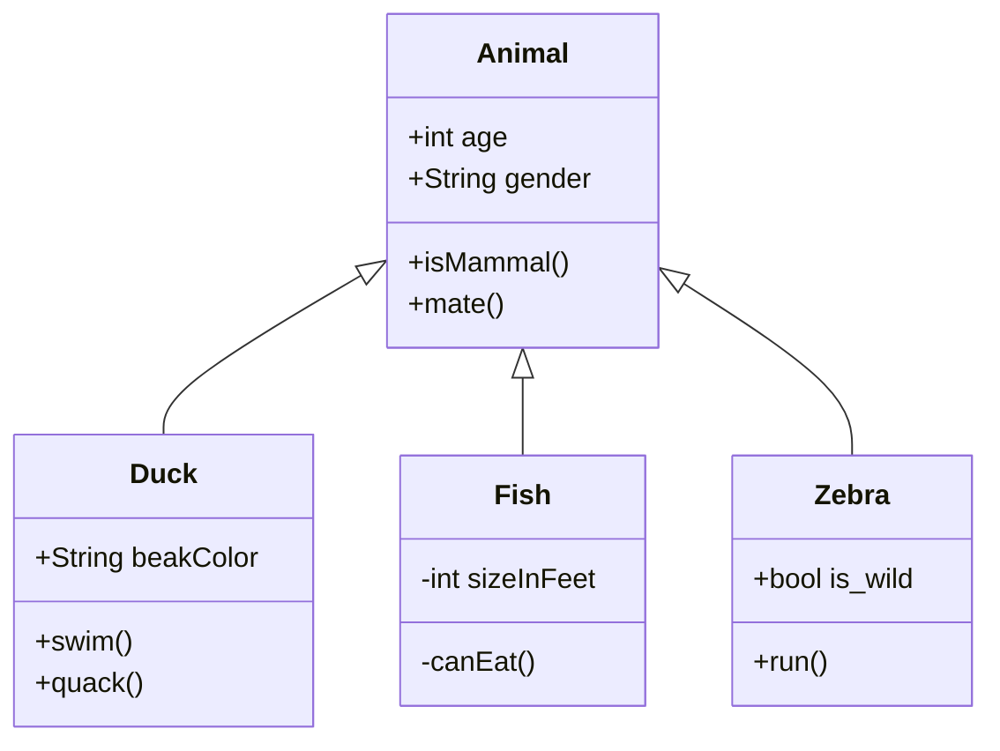

# gitlek
_Userstory 001_
```js
function hello() {
alert("HELLO");
}
```
_Userstory 002_
```java
Något med java
```

_Userstory 003_

```

```
_Userstory 004_
```js
const cat = "I'm a cat!"
```


_Userstory 006_
```
| Tables   |      Are      |  Cool |
|----------|:-------------:|------:|
| col 1 is |  left-aligned | $1600 |
| col 2 is |    centered   |   $12 |
| col 3 is | right-aligned |    $1 |
```

## US 05
```
[GitHub](https://github.com "Link to Github")


```
_Userstory 007_
```
*This is italic with asterix* and _This is italic with underlines_
```
